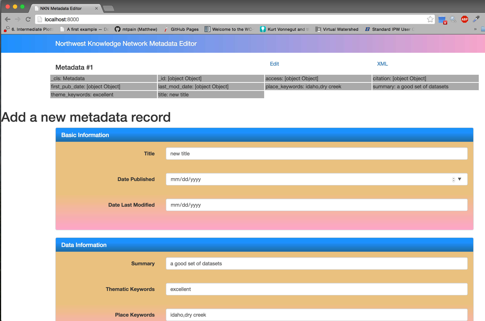

mdedit: Optimize the whole metadata workflow
================================================= 

This is a project to build a user-friendly metadata editor for use primarily by
scientists and data managers who create and share geospatial data. 


Steps to Run it Locally
-----------------------

1. Get NKN's `mdedit` code
``````````````````````````

Clone the repository using git

.. code-block:: bash

    git clone https://github.com/northwest-knowledge-network/mdedit.git

Or you might try using the nice `OS X GUI client provided by GitHub <https://mac.github.com/>`_.

2.1 Install dependency MongoDB
``````````````````````````````

Then you need to install and start MongoDB, the database we use for a canonical representation of editor-created metadata.
The easiest way is to use `homebrew, the missing package manager for OS X <http://brew.sh/>`_, which can be installed by entering 
this at the command line

.. code-block:: bash

    ruby -e "$(curl -fsSL https://raw.githubusercontent.com/Homebrew/install/master/install)"


Then use homebrew to install MongoDB

.. code-block:: bash
    
    brew install mongo


When this finishes, it gives us two instructions to follow to start using MongoDB, 

.. code-block::
    
    To have launchd start mongodb at login:
        ln -sfv /usr/local/opt/mongodb/\*.plist ~/Library/LaunchAgents
    Then to load mongodb now:
        launchctl load ~/Library/LaunchAgents/homebrew.mxcl.mongodb.plist


Follow these instructions, then type `mongo` at the command line. 
If you see a new prompt ending with ``>`` 
then MongoDB is installed and ready.


2.2 Set up a Python virtual environment and install Python dependencies
```````````````````````````````````````````````````````````````````````

Make sure you have pip installed, a command-line package management tool for Python.  If you have Python 2.7.9 or higher,
you should already have pip. To check if you have pip installed, 

.. code-block:: bash

    which pip


If you see a path to pip, something like `/usr/local/bin/pip`, then you do have pip installed. If you don't, 
run 

.. code-block:: bash

    sudo easy_install pip


Now install virtualenv and set up your environment with all the Python packages used by `mdedit`

.. code-block:: bash
    
    pip install virtualenv
    virtualenv -p /usr/bin/python2.7 venv
    source venv/bin/activate
    pip install -r requirements.txt

2.3 Use Bower to install Javascript dependencies
````````````````````````````````````````````````

First, install Node.js and the node package manager, ``npm``. If running on
Linux, use your package manager to install node. The rest of this will be for
OS X. To install npm and Node on OS X, use homebrew

.. code-block:: bash
    
    brew install node

Then install Bower, another sort of package manager, globally like so using
your newly-installed node package manager.

.. code-block:: bash

    npm install -g bower

Now bower should be installed. From the root mdedit directory, run

.. code-block:: bash

    bower install

``bower`` will check ``bower.json`` for where to install packages including
Angular.js, Twitter Bootstrap, and JQuery.

     
3. Run the development web servers
``````````````````````````````````

Finally, we will start the two web servers, front and back end, needed for our mdedit package. To do this, run ``startup.py``

.. code-block:: bash

    ./startup.py 

If all is well, you can navigate to http://localhost:8000 in your browser and see the colorful front end of the
metadata editor: 



There is no explicit connection between the front end and the
back end server. To see the back end emit metadata, try these routes:

- http://localhost:4000/api/metadata: list of all Mongo records
- http://localhost:4000/api/metadata/form: construct used to build front end web
  form
- ``http://localhost:4000/api/metadata/{_oid}/xml``: Emit a generic XML record to be
  used by developers as a base for running XSLTs. Get ``_oid`` by inspecting
  a record from http://localhost:4000/api/metadata

You can view an XML record for some metadata easily by clicking the ``XML`` link
above the currently ugly list items. Or, to do it manually, find the ``_oid`` of
interest by inspecting the list of JSON metadata at
http://localhost:4000/api/metadata, find a metadata record of interest, copy the
``_oid`` and insert it into the URL like so, and put the URL in your browser:
``http://localhost:4000/api/metadata/{_oid}/xml``.  The braces and any other
quotes should be dropped.


More info
---------

The back end is written in `Flask <http://flask.pocoo.org/>`_. The front end is
written in JQuery/javascript with `Handlebars templating <http://handlebarsjs.com/>`_,
though Angular may be in our near future.
These two are totally separate, which is why they are hosted on two separate
servers. At NKN, we need this because we want to deploy our front end app to
many of our clients' content management systems with a single metadata server
handling requests from all of them.
